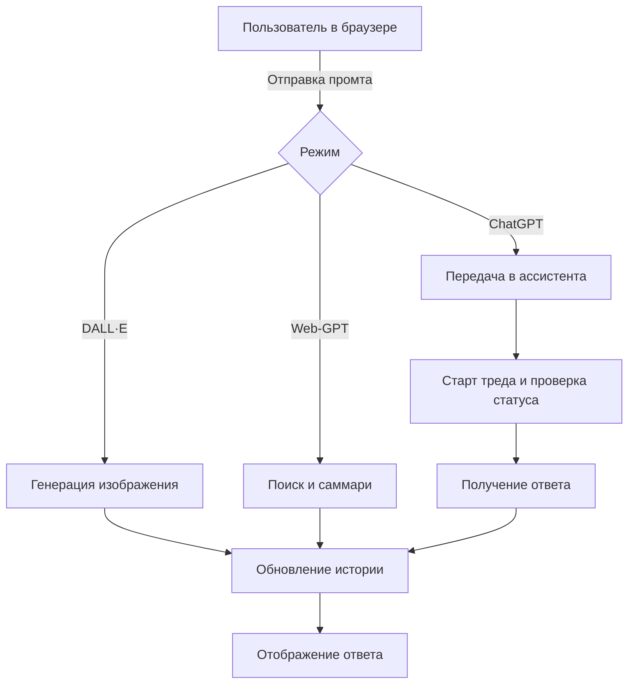

# GalxGPT

GalxGPT — это веб-интерфейс на Flask для взаимодействия с OpenAI. Он поддерживает три режима:

* **ChatGPT** — обычный чат с возможностью передать файл.
* **DALL·E** — генерация изображений по тексту.
* **Web‑GPT** — поиск в интернете с последующим подсчётом результатов.

## Шаги работы

1. Пользователь открывает главную страницу и вводит промт, может прикрепить изображение (PNG/JPG) или выбрать режим DALL·E или Web‑GPT.
2. Если выбран DALL·E, функция `generate_image` создаёт изображение и ссылка на него сохраняется в истории.
3. Если выбран Web‑GPT, поисковые запросы и саммари генерируются специальными ассистентами, а затем результат встраивается в поток переписки.
4. В обычном чате промт и возможно файл добавляются в сообщение потока через `form_thread_message`.
5. После создания тред запускается через `start_thread_run`, статус проверяется функцией `check_thread_stat`, а ответ достаётся путём `get_answer`.
6. Результат добавляется в историю сессии и отображается на странице.



## Установка

1. **Клонируйте репозиторий**
   ```bash
   git clone https://github.com/MrBengalord/GalxGPT
   cd GalxGPT/web_ui
   ```
2. **Создайте файл `.env`** с необходимыми ключами:
   ```
   API_KEY=your_openai_api_key
   ASSISTANT_ID=main_assistant_id
   ASSISTANT_ID_Search_query_builder=search_builder_id
   ASSISTANT_ID_Web_summarize=web_summarizer_id
   ```
3. **Установите зависимости**
   ```bash
   python -m venv .venv
   source .venv/bin/activate
   pip install -r requirements.txt
   ```
4. **Запустите**
   ```bash
   python app.py
   ```
   или с Docker:
   ```bash
   docker-compose up --build
   ```
